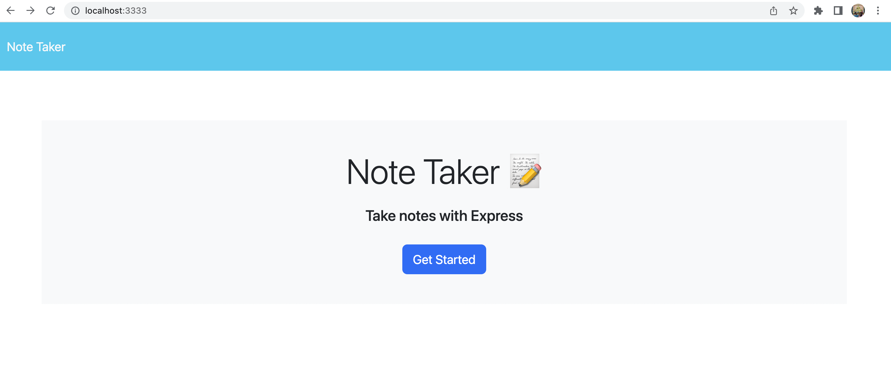
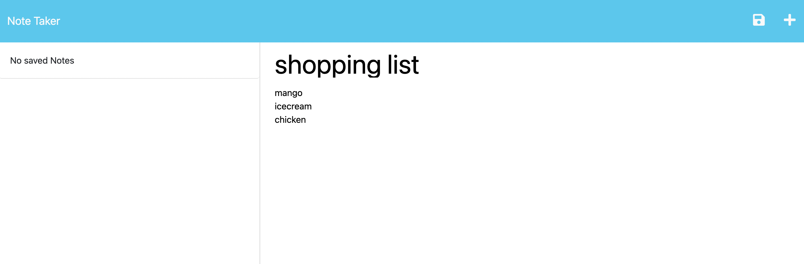
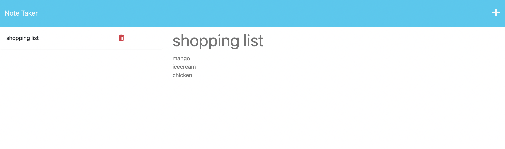

# Take-a-Note

## Table Of Contents

[Description](#description)

[Usuage Information](#usuage-information)

[Questions](#questions)

[License](#license)

## Description

It is a nodejs application that allows a user to write notes and save them. The user will see all the saved notes in the left hand side where they also can delete the saved notes.

## Usuage Information

start the application by running `node server.js`.

## License

Licensed under the [MIT](https://choosealicense.com/licenses/mit) license.

## Questions

[Github repo](https://github.com/devAsmi/take-a-note)

## ScreenShot

